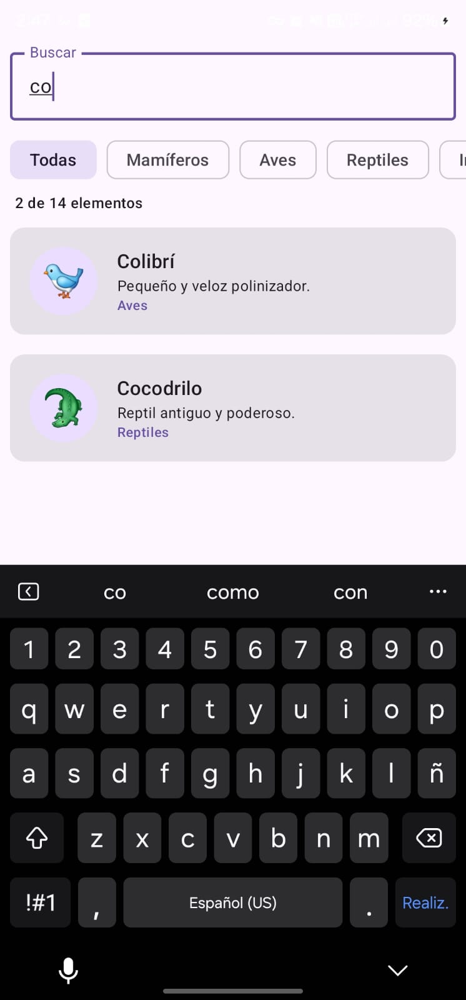
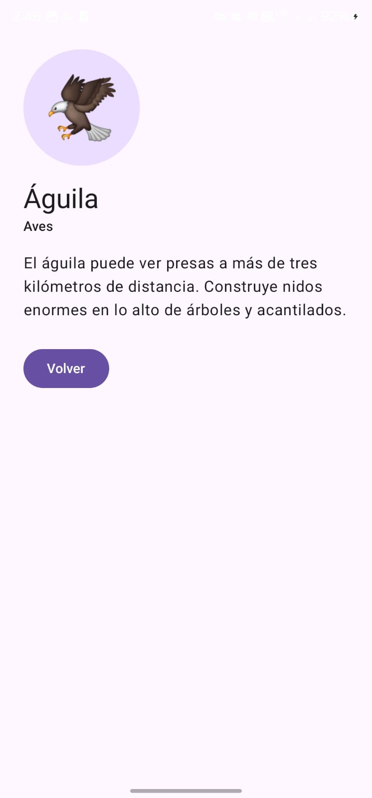

# ANALISIS.md — Taller 5

## Predicción inicial (antes de codificar)

Si el usuario toca la MISMA tarjeta tres veces rápido antes de que cargue el detalle, predigo que se llamará `navigate()` **tres veces** y quedarán **tres pantallas de detalle apiladas** encima de la lista. Para volver a la lista habría que presionar "Volver" tres veces.

## Parte 3 — Cacería de bugs

### 3.1 Comportamiento observado (antes de la corrección)

Con `navController.navigate("detalle/$id")` sin opciones, tocar la misma tarjeta varias veces muy rápido abre varias pantallas de detalle idénticas. Al presionar "Volver" no se regresa a la lista sino a otro detalle igual; hay que presionar "Volver" tantas veces como toques se hicieron.

### 3.2 Causa técnica

- El `NavController` mantiene una **pila (back stack)** de `NavBackStackEntry`.
- Cada llamada a `navigate()` **apila** un destino nuevo por defecto, sin revisar qué hay en el tope.
- La transición de la lista al detalle dura unos cientos de milisegundos. Durante ese tiempo la lista sigue en pantalla y su `clickable` sigue activo, así que cada toque vuelve a llamar a `navigate()`.
- Resultado: `lista → detalle/5 → detalle/5 → detalle/5`.

### 3.3 Corrección

```kotlin
navController.navigate("detalle/$id") {
    launchSingleTop = true
}
```

Con `launchSingleTop = true`, antes de apilar el `NavController` revisa si el destino del tope es el mismo destino (`detalle/{elementoId}`). Si lo es, **reutiliza la entrada del tope** en vez de crear una nueva. La pila queda `lista → detalle/5` y un solo "Volver" regresa a la lista.

Mejora extra: el botón "Volver" solo llama a `popBackStack()` si la pantalla de detalle está en estado `RESUMED`. Así, si se toca "Volver" dos veces rápido, no se saca también la lista de la pila (lo que dejaría la app en blanco).

### 3.4 Caso límite: dos tarjetas distintas

- **Mismo destino repetido** (tocar la tarjeta 5 varias veces): es un error del usuario (doble toque) y `launchSingleTop` lo resuelve.
- **Destinos distintos en cadena** (ir del detalle 3 al detalle 5) sería navegación legítima: el usuario quiere ver dos cosas y "Volver" debería llevarlo al anterior.
- Detalle importante: `launchSingleTop` compara el **destino (la ruta patrón `detalle/{elementoId}`)**, no el valor del argumento. Si se tocan la tarjeta 3 y la 5 muy rápido desde la lista, la segunda navegación encuentra `detalle/{elementoId}` en el tope y lo reemplaza con el argumento 5. Queda `lista → detalle/5`: se ve el último elemento tocado y un solo "Volver" regresa a la lista. En esta app es el comportamiento deseado, porque los dos toques salieron de la lista, no de una cadena de detalles.

## Parte 4 — Bonus implementados

- **Opción A:** chips de categoría (`FilterChip`) combinados con la búsqueda por texto.
- **Opción B:** `rememberLazyListState()` se crea en `AppNavigation`, por encima del `NavHost`, así que al volver del detalle la lista conserva su posición de scroll. El texto de búsqueda y la categoría también se elevan con `rememberSaveable`, por eso se conservan al volver.

## Evidencias

| Evidencia | Archivo |
|---|---|
| Lista con búsqueda activa ("co" → 2 de 14 elementos) | [evidencias/1_lista_busqueda.jpg](evidencias/1_lista_busqueda.jpg) |
| Pantalla de detalle (Águila) | [evidencias/2_detalle.jpg](evidencias/2_detalle.jpg) |
| Bug **antes** de la corrección (sin `launchSingleTop`): varios toques rápidos apilan detalles repetidos y hay que presionar "Volver" varias veces | [evidencias/3_bug_antes.mp4](evidencias/3_bug_antes.mp4) |
| **Después** de la corrección (con `launchSingleTop = true`): un solo "Volver" regresa a la lista | [evidencias/4_bug_despues.mp4](evidencias/4_bug_despues.mp4) |



